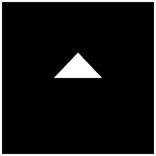

[返回目录](../README.md) 

# 十四，绘制多边形

## 绘制流程
这次终于该绘制多边形了，之前的文章（[着色器的编译和连接](./11.md)）中介绍了HTML，顶点着色器和片段着色器，这次看一下javascript从开始到最终的全部处理。

如果前两篇文章介绍的内容完全理解的话，这次的内容也应该不难了。或许会有不容易理解的地方，不要着急。

首先，我先贴出所有代码，然后在慢慢说明。

#### script.js的全部代码
```
onload = function(){
    // canvas对象获取
    var c = document.getElementById('canvas');
    c.width = 300;
    c.height = 300;
 
    // webgl的context获取
    var gl = c.getContext('webgl') || c.getContext('experimental-webgl');
    
    // 设定canvas初始化的颜色
    gl.clearColor(0.0, 0.0, 0.0, 1.0);
    
    // 设定canvas初始化时候的深度
    gl.clearDepth(1.0);
    
    // canvas的初始化
    gl.clear(gl.COLOR_BUFFER_BIT | gl.DEPTH_BUFFER_BIT);
    
    // 顶点着色器和片段着色器的生成
    var v_shader = create_shader('vs');
    var f_shader = create_shader('fs');
    
    // 程序对象的生成和连接
    var prg = create_program(v_shader, f_shader);
    
    // attributeLocation的获取
    var attLocation = gl.getAttribLocation(prg, 'position');
    
    // attribute的元素数量(这次只使用 xyz ，所以是3)
    var attStride = 3;
    
    // 模型（顶点）数据
    var vertex_position = [
         0.0, 1.0, 0.0,
         1.0, 0.0, 0.0,
        -1.0, 0.0, 0.0
    ];
    
    // 生成VBO
    var vbo = create_vbo(vertex_position);
    
    // 绑定VBO
    gl.bindBuffer(gl.ARRAY_BUFFER, vbo);
    
    // 设定attribute属性有効
    gl.enableVertexAttribArray(attLocation);
    
    // 添加attribute属性
    gl.vertexAttribPointer(attLocation, attStride, gl.FLOAT, false, 0, 0);
    
    // 使用minMatrix.js对矩阵的相关处理
    // matIV对象生成
    var m = new matIV();
    
    // 各种矩阵的生成和初始化
    var mMatrix = m.identity(m.create());
    var vMatrix = m.identity(m.create());
    var pMatrix = m.identity(m.create());
    var mvpMatrix = m.identity(m.create());
    
    // 视图变换坐标矩阵
    m.lookAt([0.0, 1.0, 3.0], [0, 0, 0], [0, 1, 0], vMatrix);
    
    // 投影坐标变换矩阵
    m.perspective(90, c.width / c.height, 0.1, 100, pMatrix);
    
    // 各矩阵想成，得到最终的坐标变换矩阵
    m.multiply(pMatrix, vMatrix, mvpMatrix);
    m.multiply(mvpMatrix, mMatrix, mvpMatrix);
    
    // uniformLocation的获取
    var uniLocation = gl.getUniformLocation(prg, 'mvpMatrix');
    
    // 向uniformLocation中传入坐标变换矩阵
    gl.uniformMatrix4fv(uniLocation, false, mvpMatrix);
    
    // 绘制模型
    gl.drawArrays(gl.TRIANGLES, 0, 3);
    
    // context的刷新
    gl.flush();
    
    // 生成着色器的函数
function create_shader(id){
    // 用来保存着色器的变量
    var shader;
    
    // 根据id从HTML中获取指定的script标签
    var scriptElement = document.getElementById(id);
    
    // 如果指定的script标签不存在，则返回
    if(!scriptElement){return;}
    
    // 判断script标签的type属性
    switch(scriptElement.type){
        
        // 顶点着色器的时候
        case 'x-shader/x-vertex':
            shader = gl.createShader(gl.VERTEX_SHADER);
            break;
            
        // 片段着色器的时候
        case 'x-shader/x-fragment':
            shader = gl.createShader(gl.FRAGMENT_SHADER);
            break;
        default :
            return;
    }
    
    // 将标签中的代码分配给生成的着色器
    gl.shaderSource(shader, scriptElement.text);
    
    // 编译着色器
    gl.compileShader(shader);
    
    // 判断一下着色器是否编译成功
    if(gl.getShaderParameter(shader, gl.COMPILE_STATUS)){
        
        // 编译成功，则返回着色器
        return shader;
    }else{
        
        // 编译失败，弹出错误消息
        alert(gl.getShaderInfoLog(shader));
    }
}
    
    // 程序对象的生成和着色器连接的函数
function create_program(vs, fs){
    // 程序对象的生成
    var program = gl.createProgram();
    
    // 向程序对象里分配着色器
    gl.attachShader(program, vs);
    gl.attachShader(program, fs);
    
    // 将着色器连接
    gl.linkProgram(program);
    
    // 判断着色器的连接是否成功
    if(gl.getProgramParameter(program, gl.LINK_STATUS)){
    
        // 成功的话，将程序对象设置为有效
        gl.useProgram(program);
        
        // 返回程序对象
        return program;
    }else{
        
        // 如果失败，弹出错误信息
        alert(gl.getProgramInfoLog(program));
    }
}
    
    // 生成VBO的函数
function create_vbo(data){
    // 生成缓存对象
    var vbo = gl.createBuffer();
    
    // 绑定缓存
    gl.bindBuffer(gl.ARRAY_BUFFER, vbo);
    
    // 向缓存中写入数据
    gl.bufferData(gl.ARRAY_BUFFER, new Float32Array(data), gl.STATIC_DRAW);
    
    // 将绑定的缓存设为无效
    gl.bindBuffer(gl.ARRAY_BUFFER, null);
    
    // 返回生成的VBO
    return vbo;
}
 
};
```

## 初始化处理
那么，从上到下按顺序来看一下吧。

首先，前提是在页面加载的同时执行script.js中的所有代码，所以，将代码全都写进了onload函数中。之后，获取canvas对象开始处理。

#### canvas的获取和初始化如下
```
    // canvas对象获取
    var c = document.getElementById('canvas');
    c.width = 300;
    c.height = 300;
 
    // webgl的context获取
    var gl = c.getContext('webgl') || c.getContext('experimental-webgl');
    
    // 设定canvas初始化的颜色
    gl.clearColor(0.0, 0.0, 0.0, 1.0);
    
    // 设定canvas初始化时候的深度
    gl.clearDepth(1.0);
    
    // canvas的初始化
    gl.clear(gl.COLOR_BUFFER_BIT | gl.DEPTH_BUFFER_BIT);
```
最先开始做的是获取canvas对象，并设定canvas的大小为宽300px，高300px。然后获取WebGL的context，以及设定清除画面所使用的颜色。

接着是设定清除的深度。使用clearDepth函数可以设定清除画面的时候的深度，以前的例子中只是对颜色进行了初始化，所以只使用了clearColor函数，其实处理三维空间的时候，深度相关的情报也需要清除，所以就用到了clearDepth函数。

同样，clear函数中的参数也做了相应的变化，不光是颜色，还包含深度，所以增加了gl.DEPTH_BUFFER_BIT常量。

## 着色器和程序对象的生成
生成顶点着色器和片段着色器，并使用程序对象进行连接。在以前的文章（着色器的编译和连接）中进行过详细的说明，可以参考一下。
#### 着色器和程序对象相关的处理
```
    // 顶点着色器和片段着色器的生成
    var v_shader = create_shader('vs');
    var f_shader = create_shader('fs');
    
    // 程序对象的生成和连接
    var prg = create_program(v_shader, f_shader);
    
    // attributeLocation的获取
    var attLocation = gl.getAttribLocation(prg, 'position');
    
    // attribute的元素数量(这次只使用 xyz ，所以是3)
    var attStride = 3;
```
注意这里出现的函数，并不是WebGL中内置的函数，而是自己写的。具体点就是说create_shader和create_program都是自己写的函数。

create_shader函数的参数是HTML中的id字符串，从script标签中获取到着色器代码，生成着色器对象并返回。上面的例子中，是根据id是vs和fs的这两个script标签中的内容，来生成顶点着色器和片段着色器。

着色器生成后，作为参数传给create_program函数，返回值就是程序对象，然后用变量保存起来。在create_program函数中，生成程序对象，并将着色器进行连接。

接着，定义了两个变量，attLocation和attStride，用来保存在后面向顶点着色器中传入数据时的必要的内容。

话说回来，看一下以前的文章中的代码中是如何使用生成的着色器的，然后就明白为什么要定义这两个变量了吧。
#### 使用顶点着色器的代码
```
attribute vec3 position;
uniform   mat4 mvpMatrix;
void main(void){
    gl_Position = mvpMatrix * vec4(position, 1.0);
}
```
这次使用着色器的时候，只使用了一个attribute变量，当然就是position了，这个position变量定义成了vec3，说明是拥有3各元素的向量。

这里的重点就是［利用一个叫做position的attribute变量］和［这个变量是vec3类型］这两点内容。其实利用attribute变量向着色器中传递数据的时候，必要的两个情报是这个数据是第几个attribute变量，以及这个变量由几个元素组成的。

也就是说，变量attLocation是为了保存这个数据是第几个，变量attStride是为了保存这个数据是由几个元素组成的。

WebGL的context中的getAttribLocation函数的两个参数，第一个参数是程序对象，第二个参数是想要获取的attribute变量的变量名。返回值是数值型，就是向顶点着色器传递数据时的序号。就是告诉我们是第几个变量。这个数值后面会使用到。

变量attStride表示顶点着色器中的attribute变量position是一个有三个元素的vec3类型的变量。这个后面也会用到。
## 顶点缓存的生成和通知
继续吧，接着是定义模型数据，并生成VBO，然后为了将VBO传给顶点着色器，进行绑定并传入数据。
#### VBO生成的相关处理
```
    // 模型（顶点）数据
    var vertex_position = [
         0.0, 1.0, 0.0,
         1.0, 0.0, 0.0,
        -1.0, 0.0, 0.0
    ];
    
    // 生成VBO
    var vbo = create_vbo(vertex_position);
    
    // 绑定VBO
    gl.bindBuffer(gl.ARRAY_BUFFER, vbo);
    
    // 设定attribute属性有効
    gl.enableVertexAttribArray(attLocation);
    
    // 添加attribute属性
    gl.vertexAttribPointer(attLocation, attStride, gl.FLOAT, false, 0, 0);
```
以前的文章（[模型数据和顶点属性](./12.md)）中也有过详细说明，将顶点数据定义为简单的数组，然后根据这个数组数据，用自定义函数create_vbo来生成顶点缓存（VBO）。

为了将顶点缓存和顶点着色器中的attribute变量联系起来，首先要向WebGL中绑定VBO。然后使用刚才获取到的attribute属性的序号，将这个attribute属性设定为有效。使用WebGL的函数enableVertexAttribArray可以让指定属性变为有效。

接着，使用WebGL函数vertexAttribPointer向着色器中写入数据。刚才定义的两个变量attLocation和attStride，在这里也用到了。
vertexAttribPointer函数的第一个参数是attribute变量的序号，第二个参数是元素数，第三个参数是指定了数据类型的内置常量。
gl.FLOAT是一个表示浮点型的常量。第四～第六各参数基本上是不怎么变的，根据内存有时候会传入其他的内容。

需要注意的是，执行vertexAttribPointer的时候，VBO对象必须先进行绑定，哪个VBO以及和它关联的attribute属性是必须的，所以不要忘了先将VBO跟WebGL进行绑定。
## 坐标变换矩阵的生成和通知
接着，是准备渲染用的坐标变换矩阵。这里使用了本网站制作的矩阵计算的库minMatrix.js，minMatrix.js的基本的使用方法在上一篇文章中（minMatrix.js和坐标变换矩阵）已经介绍过了。
#### 坐标变换矩阵的生成以及相关的处理
```
    // 使用minMatrix.js对矩阵的相关处理
    // matIV对象生成
    var m = new matIV();
    
    // 各种矩阵的生成和初始化
    var mMatrix = m.identity(m.create());
    var vMatrix = m.identity(m.create());
    var pMatrix = m.identity(m.create());
    var mvpMatrix = m.identity(m.create());
    
    // 视图变换坐标矩阵
    m.lookAt([0.0, 1.0, 3.0], [0, 0, 0], [0, 1, 0], vMatrix);
    
    // 投影坐标变换矩阵
    m.perspective(90, c.width / c.height, 0.1, 100, pMatrix);
    
    // 各矩阵想成，得到最终的坐标变换矩阵
    m.multiply(pMatrix, vMatrix, mvpMatrix);
    m.multiply(mvpMatrix, mMatrix, mvpMatrix);
    
    // uniformLocation的获取
    var uniLocation = gl.getUniformLocation(prg, 'mvpMatrix');
    
    // 向uniformLocation中传入坐标变换矩阵
    gl.uniformMatrix4fv(uniLocation, false, mvpMatrix);
```
这次，模型变换矩阵初始化之后没有做任何处理就直接使用了，当然，并不是说不能操作模型变换矩阵，现在就先这么使用了。

视图变换矩阵使用minMatrix.js中定义的matIV.lookAt函数可以生成，向上面这样，是将三维空间中的镜头放在了从原点开始向上移动1.0，向后移动3.0的地方，原点是参考点，镜头的方向指向Y轴方向。

投影变换矩阵是使用matIV.perspective生成的，视角是90度，屏幕比例为canvas的大小比例，然后分别指定了近截面和远截面。

然后将模型，视图，投影的各个变换矩阵相乘，得到最终的坐标变换矩阵mvpMatrix，然后通知WebGL就可以了。

向WebGL中传入uniform变量的时候，和attribute变量一样，首先获取变量的序号，使用WebGL的getUniformLocation函数，传入程序对象和变量的名字，就可以得到uniform变量的序号了。

得到了序号之后，向顶点着色器中传递数据，这时候使用WebGL的uniformMatrix4fv函数，第一个参数是uniform变量的序号，第二个参数是矩阵是否进行转置（true的话，有时候程序会崩溃），第三个参数是实际的坐标变换矩阵。
### uniform系列函数相关
这次出现的uniformMatrix4fv只是uniform系列函数的一个，uniform系列函数有很多种，主要分为以下几大类。
#### uniform 系列
uniform系列有uniform1 ～ uniform4，分别在向顶点着色器中传入一个到四各元素时使用。根据传给顶点着色器的数据的类型为整型或者浮点型，数字的后面会加上i(int)或者f(float)等小写字母。比如，传给着色器的数据是有两个元素的浮点型数据的时候，使用uniform2f。

示例 ： gl.uniform2f(uniformLocation, date1, data2);
#### uniform v 系列
这一系列，基本上和上面的uniform系列没有太大差别，传入的数据是数组的时候使用。和uniform系列一样，有1 ～ 4、数据类型也是在后面添加i或者f。

示例 : gl.uniform3iv(uniformLocation, Array);
#### uniformMatrix 系列
看名字就应该知道了，这个系列是在矩阵的时候使用。当然，矩阵不可能出现1，所以只有2 ～ 4。而且，矩阵中基本上只使用浮点型小数、所以，数据类型也不存在i，数据就是以使用数组为前提的，所以后面加不加v都是没有区别的。

示例 : gl.uniformMatrix4fv(uniformLocation, false, Matrix);
## 模型的绘制和context的刷新
着色器，顶点数据，坐标变换矩阵等，各种准备工作都完工了，终于该写绘制命令了。
#### 绘制命令和刷新
```
// 绘制模型
gl.drawArrays(gl.TRIANGLES, 0, 3);
 
// context的刷新
gl.flush();
```
执行WebGL的drawArrays函数的话，模型就被绘制到了缓存中了，这里之所以说是［缓存中］，是因为当执行drawArrays函数的时候，还没有把多边形绘制到画面上。

要想把模型绘制到画面上，必须执行WebGL的flush函数，这样才能把结果反映到画面上。

这里出现的drawArrays函数，第一个参数是指定如何使用顶点进行绘图的一个常量，第二个参数是从第几个顶点开始使用，第三个参数是绘制几个顶点。

这一次，使用的是gl.TRAIANGLES，所以顶点被当成了纯粹的三角形多边形，利用三个顶点进行了绘制。

## 总结
这次的文章有点太长了，贴出的代码量有点多，可能有人会吃了一惊吧。

其实这次的代码绘制的只是一个简单的三角形。只是这样，却写了这么长的代码，所以才说3D开发是比较难的。

但是，个人认为，即使这样，和DirectX相比较的话，已经相当简单，简练了。

单从开发环境上来说，不需要特别的开发环境，WebGL这一点已经很轻松了吧。理解了本次的内容的话，只需要稍微慢慢的调整一下，就可以实现很多效果。这以后的内容，都是以这次的内容为基础的，所以必须要好好的理解一下。

本文章最后，给出本文demo的链接，如果浏览器支持的话，直接看demo比较直观吧。

渲染三角形的demo: 



[http://wgld.org/s/sample_002/](http://wgld.org/s/sample_002/)