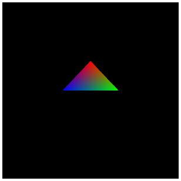

[返回目录](../README.md) 

# 十五，为多边形涂抹颜色（顶点颜色的指定）

## 增加顶点属性的个数
上次，终于绘制了一个三角形，但是只绘制了一个纯白色的多边形。

这次，给多边形的顶点中添加颜色属性，基本上做的事情和上一篇文章一样，只是稍微增加点步骤而已。

首先，就像以前多次重复的那样，顶点可以包含很多种情报（参考：顶点缓存和基础），而且每一个情报叫做一个顶点属性。上一篇的demo，顶点种只包含了位置情报这一个顶点属性，这一次添加一个颜色的顶点属性。

一个顶点属性，需要有一个东西和它对应，还记得吧。

## 着色器代码的修改
那么，先从着色器的代码开始看吧。

这次，需要两个attribute变量。分别是为了接收顶点的位置和颜色。

#### 顶点着色器的代码
```
attribute vec3 position;
attribute vec4 color;
uniform   mat4 mvpMatrix;
varying   vec4 vColor;
 
void main(void){
    vColor = color;
    gl_Position = mvpMatrix * vec4(position, 1.0);
}
```
可以看到，一同声明了两个attribute变量，position和上次一样，没有变化，在它下面多了一个color，是为了处理顶点的颜色。

而上一篇中没有出现的varying变量，这一次也出现了。就当作是复习了，再简单说一下，varying变量是顶点着色器和片段着色器之间的桥梁。看一下main函数中的代码就知道了，只需要将attribute变量中的顶点的颜色直接赋值给varying变量。

加了这个处理之后，顶点着色器中的顶点属性就能传给片段着色器了。当然，顶点着色器中不需要做任何处理就能将数据传给片段着色器，这也是可编辑渲染管线的优点之一。

接着，看片段着色器。

#### 片段着色器的代码
```
precision mediump float;
varying vec4 vColor;
void main(void){
    gl_FragColor = vColor;
}
```
上一篇中使用的片段着色器，直接将颜色数据代入到了中的gl_FragColor中，所以绘制出的三角形是单色的。这一次，使用从顶点着色器传来的varying类型的变量vColor，那么顶点的颜色属性就会对多边形产生影响。

＊虽然说顶点着色器和片段着色器中都使用了同样的名字的varying变量，但是其实是两个完全不同的变量。
#### 指定精确度的precision
```
这一次的片段着色器中的第一行，出现了一个陌生的precision，这个precision是用来指定数值的精确度的关键字，紧接着跟在precision后面的是精确度修饰符。
这个修饰符有三种，简单点说就是指定精确度为上，中，下。其实，变量中使用的小数发生变化时（也就是说，处理的数值的位数增加或是减少），根据运行的环境不同得到的结果是不太统一的。
lowp   ：精确度低
mediump：精确度中
highp  ：精确度高
上面的片段着色器代码中，precision后面紧接着写的是mediump float，这是说，让片段着色器中的float类型的数值的精确度都按照mediump来用。
不管在片段着色器中有没有做什么特殊的处理，首先要将precision相关的设定写上，否则在编译着色器的时候会出错。这就像魔法的咒语一样，逃不掉的。
```
## 顶点缓存相关的处理

着色器之后，该是VBO了。这里虽然增加了一些内容，其实只是同样的东西做了两次，仔细看的话，就会明白过来，跟上次基本上没什么变化吧。
#### 顶点数据的矩阵的做成
```
// 从数组中获取attributeLocation
var attLocation = new Array(2);
attLocation[0] = gl.getAttribLocation(prg, 'position');
attLocation[1] = gl.getAttribLocation(prg, 'color');
 
// 将元素数attribute保存到数组中
var attStride = new Array(2);
attStride[0] = 3;
attStride[1] = 4;
 
// 保存顶点的位置情报的数组
var vertex_position = [
     0.0, 1.0, 0.0,
     1.0, 0.0, 0.0,
    -1.0, 0.0, 0.0
];
 
// 保存顶点的颜色情报的数组
var vertex_color = [
    1.0, 0.0, 0.0, 1.0,
    0.0, 1.0, 0.0, 1.0,
    0.0, 0.0, 1.0, 1.0
];
```
上次的顶点属性只有一个，所以保存顶点属性的序号的是一个纯粹的变量。这次，顶点属性有两个，所以使用了数组。而颜色是由RGBA四个元素组成的，所以颜色情报的数组长度为[顶点数 x 4]。

将顶点数据保存到数组之后，下一步就是根据数组来生成VBO了。下面是代码。
#### 根据顶点数据数组生成VBO
```
// 生成VBO
var position_vbo = create_vbo(vertex_position);
var color_vbo = create_vbo(vertex_color);
 
// VBO绑定(位置情报)
gl.bindBuffer(gl.ARRAY_BUFFER, position_vbo);
gl.enableVertexAttribArray(attLocation[0]);
gl.vertexAttribPointer(attLocation[0], attStride[0], gl.FLOAT, false, 0, 0);
 
// VBO绑定(颜色情报)
gl.bindBuffer(gl.ARRAY_BUFFER, color_vbo);
gl.enableVertexAttribArray(attLocation[1]);
gl.vertexAttribPointer(attLocation[1], attStride[1], gl.FLOAT, false, 0, 0);
```
生成VBO之后，进行绑定，写入数据等处理，位置情报和颜色情报都是相同的，所以是重复了两次相同的处理。有人看到这里可能会有些想法了，VBO周围的处理，可以直接做成一个函数，将数组当作参数传进来基本上就解决了。

## 总结
以上，就是与上一篇的内容相比的变更点。主要就是着色器和VBO周围的处理有了些小变化。如果再给顶点增加其他新的属性的话，就依葫芦画瓢，像本次的内容一样，按照同样的步骤，再重复一遍就可以了，这样就可以给顶点自由的添加属性了。

最后，贴出本篇文章的demo的全部代码，链接也在最后给出，大家可以参考一下。

#### demo的HTML代码
```
<html>
    <head>
        <title>WebGL TEST</title>
        <script src="script.js" type="text/javascript"></script>
        <script src="minMatrix.js" type="text/javascript"></script>
        
        <script id="vs" type="x-shader/x-vertex">
attribute vec3 position;
attribute vec4 color;
uniform   mat4 mvpMatrix;
varying   vec4 vColor;
 
void main(void){
    vColor = color;
    gl_Position = mvpMatrix * vec4(position, 1.0);
}
        </script>
        
        <script id="fs" type="x-shader/x-fragment">
precision mediump float;
 
varying vec4 vColor;
 
void main(void){
    gl_FragColor = vColor;
}
        </script>
    </head>
    <body>
        <canvas id="canvas"></canvas>
    </body>
</html>
```
#### demo的javascript代码
```
onload = function(){
    // canvas对象获取
    var c = document.getElementById('canvas');
    c.width = 300;
    c.height = 300;
 
    // webgl的context获取
    var gl = c.getContext('webgl') || c.getContext('experimental-webgl');
    
    // 设定canvas初始化的颜色
    gl.clearColor(0.0, 0.0, 0.0, 1.0);
    
    // 设定canvas初始化时候的深度
    gl.clearDepth(1.0);
    
    // canvas的初始化
    gl.clear(gl.COLOR_BUFFER_BIT | gl.DEPTH_BUFFER_BIT);
    
    // 顶点着色器和片段着色器的生成
    var v_shader = create_shader('vs');
    var f_shader = create_shader('fs');
    
    // 程序对象的生成和连接
    var prg = create_program(v_shader, f_shader);
    
    // attributeLocation的获取
    var attLocation = new Array(2);
    attLocation[0] = gl.getAttribLocation(prg, 'position');
    attLocation[1] = gl.getAttribLocation(prg, 'color');
    
	// 将元素数attribute保存到数组中
	var attStride = new Array(2);
	attStride[0] = 3;
	attStride[1] = 4;
 
	// 保存顶点的位置情报的数组
	var vertex_position = [
	     0.0, 1.0, 0.0,
 	    1.0, 0.0, 0.0,
	    -1.0, 0.0, 0.0
	];
 
	// 保存顶点的颜色情报的数组
    var vertex_color = [
        1.0, 0.0, 0.0, 1.0,
        0.0, 1.0, 0.0, 1.0,
        0.0, 0.0, 1.0, 1.0
    ];
    
    // 生成VBO
    var position_vbo = create_vbo(vertex_position);
    var color_vbo = create_vbo(vertex_color);
    
    // VBO绑定(位置情报)
    gl.bindBuffer(gl.ARRAY_BUFFER, position_vbo);
    gl.enableVertexAttribArray(attLocation[0]);
    gl.vertexAttribPointer(attLocation[0], attStride[0], gl.FLOAT, false, 0, 0);
    
    // VBO绑定(颜色情报)
    gl.bindBuffer(gl.ARRAY_BUFFER, color_vbo);
    gl.enableVertexAttribArray(attLocation[1]);
    gl.vertexAttribPointer(attLocation[1], attStride[1], gl.FLOAT, false, 0, 0);
    
    // 使用minMatrix.js对矩阵的相关处理
    // matIV对象生成
    var m = new matIV();
    
    // 各种矩阵的生成和初始化
    var mMatrix = m.identity(m.create());
    var vMatrix = m.identity(m.create());
    var pMatrix = m.identity(m.create());
    var mvpMatrix = m.identity(m.create());
    
    // 视图变换坐标矩阵
    m.lookAt([0.0, 1.0, 3.0], [0, 0, 0], [0, 1, 0], vMatrix);
    
    // 投影坐标变换矩阵
    m.perspective(90, c.width / c.height, 0.1, 100, pMatrix);
    
    // 各矩阵想成，得到最终的坐标变换矩阵
    m.multiply(pMatrix, vMatrix, mvpMatrix);
    m.multiply(mvpMatrix, mMatrix, mvpMatrix);
    
    // uniformLocation的获取
    var uniLocation = gl.getUniformLocation(prg, 'mvpMatrix');
    
    // 向uniformLocation中传入坐标变换矩阵
    gl.uniformMatrix4fv(uniLocation, false, mvpMatrix);
    
    // 绘制模型
    gl.drawArrays(gl.TRIANGLES, 0, 3);
    
    // context的刷新
    gl.flush();
    
    // 生成着色器的函数
    function create_shader(id){
        // 用来保存着色器的变量
        var shader;
        
        // 根据id从HTML中获取指定的script标签
        var scriptElement = document.getElementById(id);
        
        // 如果指定的script标签不存在，则返回
        if(!scriptElement){return;}
        
        // 判断script标签的type属性
        switch(scriptElement.type){
            
            // 顶点着色器的时候
            case 'x-shader/x-vertex':
                shader = gl.createShader(gl.VERTEX_SHADER);
                break;
                
            // 片段着色器的时候
            case 'x-shader/x-fragment':
                shader = gl.createShader(gl.FRAGMENT_SHADER);
                break;
            default :
                return;
        }
        
        // 将标签中的代码分配给生成的着色器
        gl.shaderSource(shader, scriptElement.text);
        
        // 编译着色器
        gl.compileShader(shader);
        
        // 判断一下着色器是否编译成功
        if(gl.getShaderParameter(shader, gl.COMPILE_STATUS)){
            
            // 编译成功，则返回着色器
            return shader;
        }else{
            
            // 编译失败，弹出错误消息
            alert(gl.getShaderInfoLog(shader));
        }
    }
    
    // 程序对象的生成和着色器连接的函数
    function create_program(vs, fs){
        // 程序对象的生成
        var program = gl.createProgram();
        
        // 向程序对象里分配着色器
        gl.attachShader(program, vs);
        gl.attachShader(program, fs);
        
        // 将着色器连接
        gl.linkProgram(program);
        
        // 判断着色器的连接是否成功
        if(gl.getProgramParameter(program, gl.LINK_STATUS)){
        
            // 成功的话，将程序对象设置为有效
            gl.useProgram(program);
            
            // 返回程序对象
            return program;
        }else{
            
            // 如果失败，弹出错误信息
            alert(gl.getProgramInfoLog(program));
        }
    }
    
    // 生成VBO的函数
    function create_vbo(data){
        // 生成缓存对象
        var vbo = gl.createBuffer();
        
        // 绑定缓存
        gl.bindBuffer(gl.ARRAY_BUFFER, vbo);
        
        // 向缓存中写入数据
        gl.bufferData(gl.ARRAY_BUFFER, new Float32Array(data), gl.STATIC_DRAW);
        
        // 将绑定的缓存设为无效
        gl.bindBuffer(gl.ARRAY_BUFFER, null);
        
        // 返回生成的VBO
        return vbo;
    }
 
};
```
给顶点添加颜色，然后绘制三角形的demo: 



[http://wgld.org/s/sample_003/](http://wgld.org/s/sample_003/)