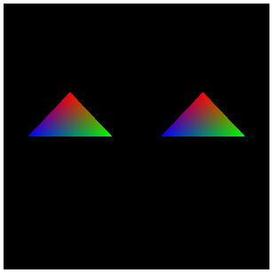

[返回目录](../README.md) 

# 十六，绘制多个模型

## 顶点缓存的重复利用
上一篇文章中，向多边形的三个顶点中添加了颜色这个新的顶点属性，给多边形涂抹了颜色。而且知道，使用新的VBO可以给对顶点属性进行自由的扩张。

那么，这次来挑战一下同时绘制多个模型。但是，不准备新的VBO，还利用上次的VBO，就是说，重复利用VBO，只操作坐标变换矩阵，来绘制多个模型。

所以，这次着色器相关的内容完全不变，完全使用上次的顶点着色器和片段着色器，javascript代码变更的地方也不多，下面重点说一下变更的部分。

## 坐标变换矩阵的重复利用
这次绘制多个模型，坐标变换矩阵相关也是重复利用。

也就是说，在实际中，将多个模型绘制到不同的位置的时候，必须要操作的坐标变换矩阵只有模型变换矩阵，而决定镜头的位置的视图变换矩阵和决定屏幕范围的投影变换矩阵这两个坐标变换矩阵，都可以使用同一个。

步骤如下，按照下面这样操作矩阵的话就可以了。
- 准备好视图和投影两个坐标变换矩阵
- 提前将两个矩阵相乘并保存起来(以下、pv)
- 准备第一个模型坐标变换矩阵(以下、m1)
- m1和pv相乘，传给uniform
- 绘制第一个模型
- 准备第二个模型坐标变换矩阵(以下、m2)
- m2和pv相乘，传给uniform
- 绘制第二个模型
- 刷新context
主要是，视图坐标变换矩阵和投影坐标变换矩阵提前相乘并保存起来，然后等模型坐标变换矩阵准备好之后，再与之前的结果相乘，传给uniform，然后绘图。

那么，来看一下实际的代码吧。

#### script.js中的部分代码
```
//各种矩阵的生成和初始化
var mMatrix = m.identity(m.create());
var vMatrix = m.identity(m.create());
var pMatrix = m.identity(m.create());
var tmpMatrix = m.identity(m.create());
var mvpMatrix = m.identity(m.create());
 
//视图x投影坐标变换矩阵
m.lookAt([0.0, 0.0, 3.0], [0, 0, 0], [0, 1, 0], vMatrix);
m.perspective(90, c.width / c.height, 0.1, 100, pMatrix);
m.multiply(pMatrix, vMatrix, tmpMatrix);
 
//移动第一个模型的模型坐标变换矩阵
m.translate(mMatrix, [1.5, 0.0, 0.0], mMatrix);
 
//模型x视图x投影(第一个模型)
m.multiply(tmpMatrix, mMatrix, mvpMatrix);
 
//将坐标变换矩阵传入uniformLocation，并绘图(第一个模型)
gl.uniformMatrix4fv(uniLocation, false, mvpMatrix);
gl.drawArrays(gl.TRIANGLES, 0, 3);
 
//移动第二个模型的模型坐标变换矩阵
m.identity(mMatrix);
m.translate(mMatrix, [-1.5, 0.0, 0.0], mMatrix);
 
//模型x视图x投影(第二个模型)
m.multiply(tmpMatrix, mMatrix, mvpMatrix);
 
//将坐标变换矩阵传入uniformLocation，并绘图(第二个模型)
gl.uniformMatrix4fv(uniLocation, false, mvpMatrix);
gl.drawArrays(gl.TRIANGLES, 0, 3);
 
//刷新context
gl.flush();
```
重点是，为了暂时保存视图和投影坐标变换矩阵，新声明了一个tmpMatrix这样的使用方法。使用matIV.multiply将视图坐标变换矩阵和投影坐标变换矩阵相乘，然后结果保存到tmpMatrix中。

然后，使用matIV.translate来操作模型坐标变换矩阵，将第一个模型向X方向移动1.5，然后将这个模型坐标变换矩阵和tmpMatrix相乘，传给uniform并进行绘图。

第二个模型的坐标矩阵，和之前相反，向X方向上移动－1.5，然后和第一个一样，和tmpMatrix相乘，传给uniform并进行绘图。

最后，刷新context，在canvas上绘制两个多边形。这样，利用VBO和一部分坐标变换矩阵，省去了不必要的代码，绘制了两个多边形。

需要注意的是，对第二个模型准备模型坐标变换矩阵的时候，首先在最初的时候使用matIV.identity对矩阵进行初始化。如果，不进行初始化直接使用matIV.translate的话，会受前一回移动的影响，导致结果改变。进行完初始化之后再进行操作，是为了避免类似这样的错误发生。

## 附加：attribute属性添加的函数化
`上次的文章中也涉及到了，增加顶点属性的时候，如果将相应的处理函数化的话可以提高效率，虽然和这次的主题（绘制多个模型）没有关系，但是因为demo中进行了函数化，所以简单的解说一下。
#### VBO的绑定相关
```
// 绑定VBO相关的函数
function set_attribute(vbo, attL, attS){
    // 处理从参数中得到的数组
    for(var i in vbo){
        // 绑定缓存
        gl.bindBuffer(gl.ARRAY_BUFFER, vbo[i]);
        
        // 将attributeLocation设置为有效
        gl.enableVertexAttribArray(attL[i]);
        
        //通知并添加attributeLocation
        gl.vertexAttribPointer(attL[i], attS[i], gl.FLOAT, false, 0, 0);
    }
}
```
这个函数有三个参数，三个参数都是数组。使用for ～ in来循环VBO中的属性，并进行绑定和添加。一般，需要准备很多个VBO，所以将这里函数化，以后可以省略很多代码了吧。

## 总结
这次操作的是模型坐标变换矩阵，介绍了重复利用VBO，视图和投影坐标变换矩阵，进行多个模型的绘制的方法。

绘制很多个简单的模型，图形的时候，像这次的做法一样，可以使处理变的简洁一些，避免写很多多余的代码。

这次的demo，HTML的代码和上一次是完全一样的，就是说，顶点着色器和片段着色器没有做任何调整。javascript代码有了一些变化，所以贴出所有代码。另外，在文章的最后面，添加了demo的链接，有支持WebGL的浏览器的话，可以直接打开链接看一下效果。

#### script.js的全部代码
```
onload = function(){
    // canvas对象获取
    var c = document.getElementById('canvas');
    c.width = 300;
    c.height = 300;
 
    // webgl的context获取
    var gl = c.getContext('webgl') || c.getContext('experimental-webgl');
    
    // 设定canvas初始化的颜色
    gl.clearColor(0.0, 0.0, 0.0, 1.0);
    
    // 设定canvas初始化时候的深度
    gl.clearDepth(1.0);
    
    // canvas的初始化
    gl.clear(gl.COLOR_BUFFER_BIT | gl.DEPTH_BUFFER_BIT);
    
    // 顶点着色器和片段着色器的生成
    var v_shader = create_shader('vs');
    var f_shader = create_shader('fs');
    
    // 程序对象的生成和连接
    var prg = create_program(v_shader, f_shader);
    
    // attributeLocation的获取
    var attLocation = new Array(2);
    attLocation[0] = gl.getAttribLocation(prg, 'position');
    attLocation[1] = gl.getAttribLocation(prg, 'color');
    
	// 将元素数attribute保存到数组中
	var attStride = new Array(2);
	attStride[0] = 3;
	attStride[1] = 4;
 
	// 保存顶点的位置情报的数组
	var vertex_position = [
	     0.0, 1.0, 0.0,
 	    1.0, 0.0, 0.0,
	    -1.0, 0.0, 0.0
	];
 
	// 保存顶点的颜色情报的数组
    var vertex_color = [
        1.0, 0.0, 0.0, 1.0,
        0.0, 1.0, 0.0, 1.0,
        0.0, 0.0, 1.0, 1.0
    ];
    
    // 生成VBO
    var pos_vbo = create_vbo(position);
    var col_vbo = create_vbo(color);
    
    // 将VBO进行绑定并添加
    set_attribute([pos_vbo, col_vbo], attLocation, attStride);
    
    // 获取uniformLocation
    var uniLocation = gl.getUniformLocation(prg, 'mvpMatrix');
    
    // 使用minMatrix.js对矩阵的相关处理
    // matIV对象生成
    var m = new matIV();
    
//各种矩阵的生成和初始化
var mMatrix = m.identity(m.create());
var vMatrix = m.identity(m.create());
var pMatrix = m.identity(m.create());
var tmpMatrix = m.identity(m.create());
var mvpMatrix = m.identity(m.create());
 
//视图x投影坐标变换矩阵
m.lookAt([0.0, 0.0, 3.0], [0, 0, 0], [0, 1, 0], vMatrix);
m.perspective(90, c.width / c.height, 0.1, 100, pMatrix);
m.multiply(pMatrix, vMatrix, tmpMatrix);
 
//移动第一个模型的模型坐标变换矩阵
m.translate(mMatrix, [1.5, 0.0, 0.0], mMatrix);
 
//模型x视图x投影(第一个模型)
m.multiply(tmpMatrix, mMatrix, mvpMatrix);
 
//将坐标变换矩阵传入uniformLocation，并绘图(第一个模型)
gl.uniformMatrix4fv(uniLocation, false, mvpMatrix);
gl.drawArrays(gl.TRIANGLES, 0, 3);
 
//移动第二个模型的模型坐标变换矩阵
m.identity(mMatrix);
m.translate(mMatrix, [-1.5, 0.0, 0.0], mMatrix);
 
//模型x视图x投影(第二个模型)
m.multiply(tmpMatrix, mMatrix, mvpMatrix);
 
//将坐标变换矩阵传入uniformLocation，并绘图(第二个模型)
gl.uniformMatrix4fv(uniLocation, false, mvpMatrix);
gl.drawArrays(gl.TRIANGLES, 0, 3);
 
//刷新context
gl.flush();
    
    // 生成着色器的函数
    function create_shader(id){
        // 用来保存着色器的变量
        var shader;
        
        // 根据id从HTML中获取指定的script标签
        var scriptElement = document.getElementById(id);
        
        // 如果指定的script标签不存在，则返回
        if(!scriptElement){return;}
        
        // 判断script标签的type属性
        switch(scriptElement.type){
            
            // 顶点着色器的时候
            case 'x-shader/x-vertex':
                shader = gl.createShader(gl.VERTEX_SHADER);
                break;
                
            // 片段着色器的时候
            case 'x-shader/x-fragment':
                shader = gl.createShader(gl.FRAGMENT_SHADER);
                break;
            default :
                return;
        }
        
        // 将标签中的代码分配给生成的着色器
        gl.shaderSource(shader, scriptElement.text);
        
        // 编译着色器
        gl.compileShader(shader);
        
        // 判断一下着色器是否编译成功
        if(gl.getShaderParameter(shader, gl.COMPILE_STATUS)){
            
            // 编译成功，则返回着色器
            return shader;
        }else{
            
            // 编译失败，弹出错误消息
            alert(gl.getShaderInfoLog(shader));
        }
    }
    
    // 程序对象的生成和着色器连接的函数
    function create_program(vs, fs){
        // 程序对象的生成
        var program = gl.createProgram();
        
        // 向程序对象里分配着色器
        gl.attachShader(program, vs);
        gl.attachShader(program, fs);
        
        // 将着色器连接
        gl.linkProgram(program);
        
        // 判断着色器的连接是否成功
        if(gl.getProgramParameter(program, gl.LINK_STATUS)){
        
            // 成功的话，将程序对象设置为有效
            gl.useProgram(program);
            
            // 返回程序对象
            return program;
        }else{
            
            // 如果失败，弹出错误信息
            alert(gl.getProgramInfoLog(program));
        }
    }
    
    // 生成VBO的函数
    function create_vbo(data){
        // 生成缓存对象
        var vbo = gl.createBuffer();
        
        // 绑定缓存
        gl.bindBuffer(gl.ARRAY_BUFFER, vbo);
        
        // 向缓存中写入数据
        gl.bufferData(gl.ARRAY_BUFFER, new Float32Array(data), gl.STATIC_DRAW);
        
        // 将绑定的缓存设为无效
        gl.bindBuffer(gl.ARRAY_BUFFER, null);
        
        // 返回生成的VBO
        return vbo;
    }
    
// 绑定VBO相关的函数
function set_attribute(vbo, attL, attS){
    // 处理从参数中得到的数组
    for(var i in vbo){
        // 绑定缓存
        gl.bindBuffer(gl.ARRAY_BUFFER, vbo[i]);
        
        // 将attributeLocation设置为有效
        gl.enableVertexAttribArray(attL[i]);
        
        //通知并添加attributeLocation
        gl.vertexAttribPointer(attL[i], attS[i], gl.FLOAT, false, 0, 0);
    }
}
 
};
```
绘制多个模型的demo: 



[http://wgld.org/s/sample_004/](http://wgld.org/s/sample_004/)