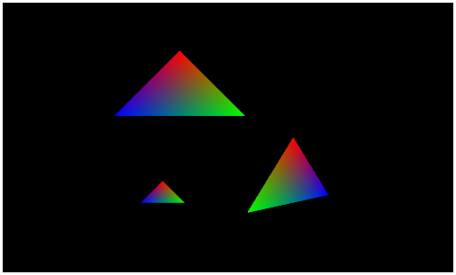

[返回目录](../README.md) 

# 十七，递归处理和移动・旋转・缩放

## 模型坐标变换矩阵的好处
上次，通过操作模型坐标变换矩阵，绘制了多个模型。这次，继续在此基础上，给多个模型再添加上旋转和放大缩小等处理。

看过上一篇文章的人应该知道，在3D渲染的世界里，利用VBO和一部分坐标变换矩阵，只需要少量修改，就可以绘制出大量的模型。当然，计算量也会变少，效率也自然得到了提升。

换句话说，能够熟练使用模型坐标变换矩阵的话，就可以实现高效的渲染，这就是模型坐标变换的好处。

这次，试着绘制三个多边形，一个多边形沿着一个圆进行移动，一个多边形沿Y轴进行旋转，第三个多边形进行放大缩小。

## 添加一个持续循环的处理
上次的demo，只是在canvas上更新了一次，这次的demo会让模型持续变化，做成一个简单的动画效果。

为了进行动画处理，需要添加一个持续的循环，在javascript中持续循环有很多种方法，本网站基本上就是使用setTimeout函数。

这里说的setTimeout函数是javascript中window对象内置的函数，在指定的时间过后，可以进行指定的处理。

经过的时间的单位是毫秒，1秒是1000毫秒，所以需要指定描述的1千倍。

## 使用setTimeout实现递归处理
按照刚才说的，使用setTimeout函数可以实现反复的循环处理，那么具体的做法是怎样的呢？

setTimeout函数的第一个参数是调用的函数，第二个参数是需要经过多长时间(毫秒)后调用这个函数。如果第一个参数指定为当前所运行的函数的话，那么就可以实现持续循环了。

- 函数A被调用
- 在函数A中，使用setTimeout，并传入函数A作为参数
- 经过指定的时间后，函数A被调用

按照上面的步骤，把WebGL中绘图部分写成递归函数，就可以持续循环了。

## arguments和callee属性
函数的内部调用函数本身的话，可以直接写函数的名字来实现，但是如果是匿名函数的话，这样的做法就行不通了。

解决的办法是有的，使用arguments和callee属性的话就可以调用函数本身了。arguments对象是函数被调用的时候自动生成的，而callee属性就是这个函数本身的引用，使用这种方法的话，即使是匿名函数也可以实现递归。

这次的递归处理，就是使用这里所说的setTimeout＋arguments.callee组合来实现。

## 递归函数中的处理
向递归函数中，添加最少限度的处理。因为在反复循环的处理中，如果添加了多余的没用的处理的话，会导致程序效率降低。

比如，WebGL的context的获取，VBO和着色器的生成等，是不用每次都调用的。一旦对象被生成的话，就可以反复利用了，同样，视图坐标变换矩阵和投影坐标变换矩阵的生成也没有必要放在递归函数中，因为每次都是使用相同的东西。

这样的话，递归函数中所包含处理就基本上限定了，具体的就是下面列出的处理。

- 清空画面
- 模型坐标变换矩阵的生成
- 向uniform中传入坐标变换矩阵
- 绘图命令
- 画面刷新
- setTimeout＋arguments.callee

那么，看一下递归函数部分的代码吧。
#### 递归函数的代码
```
// minMatrix.js中的矩阵相关的处理
// matIV对象的生成
var m = new matIV();
 
// 各种矩阵的生成和初始化
var mMatrix = m.identity(m.create());
var vMatrix = m.identity(m.create());
var pMatrix = m.identity(m.create());
var tmpMatrix = m.identity(m.create());
var mvpMatrix = m.identity(m.create());
 
// 视图x投影坐标变换矩阵
m.lookAt([0.0, 0.0, 5.0], [0, 0, 0], [0, 1, 0], vMatrix);
m.perspective(45, c.width / c.height, 0.1, 100, pMatrix);
m.multiply(pMatrix, vMatrix, tmpMatrix);
 
// 声明计数器
var count = 0;
 
// 持续循环
(function(){
    // canvasを初期化
    gl.clearColor(0.0, 0.0, 0.0, 1.0);
    gl.clearDepth(1.0);
    gl.clear(gl.COLOR_BUFFER_BIT | gl.DEPTH_BUFFER_BIT);
    
    // 计数器递增
    count++;
    
    // 使用计数器算出角度
    var rad = (count % 360) * Math.PI / 180;
    
    // 模型1按照一个圆形轨道进行旋转
    var x = Math.cos(rad);
    var y = Math.sin(rad);
    m.identity(mMatrix);
    m.translate(mMatrix, [x, y + 1.0, 0.0], mMatrix);
    
    // 完成模型1的坐标变换矩阵，并进行绘图
    m.multiply(tmpMatrix, mMatrix, mvpMatrix);
    gl.uniformMatrix4fv(uniLocation, false, mvpMatrix);
    gl.drawArrays(gl.TRIANGLES, 0, 3);
    
    // 模型2沿Y轴进行旋转
    m.identity(mMatrix);
    m.translate(mMatrix, [1.0, -1.0, 0.0], mMatrix);
    m.rotate(mMatrix, rad, [0, 1, 0], mMatrix);
    
    // 完成模型2的坐标变换矩阵，并进行绘图
    m.multiply(tmpMatrix, mMatrix, mvpMatrix);
    gl.uniformMatrix4fv(uniLocation, false, mvpMatrix);
    gl.drawArrays(gl.TRIANGLES, 0, 3);
    
    // 模型3进行放大缩小
    var s = Math.sin(rad) + 1.0;
    m.identity(mMatrix);
    m.translate(mMatrix, [-1.0, -1.0, 0.0], mMatrix);
    m.scale(mMatrix, [s, s, 0.0], mMatrix)
    
    // 完成模型3的坐标变换矩阵，并进行绘图
    m.multiply(tmpMatrix, mMatrix, mvpMatrix);
    gl.uniformMatrix4fv(uniLocation, false, mvpMatrix);
    gl.drawArrays(gl.TRIANGLES, 0, 3);
    
    // context刷新
    gl.flush();
    
    // 为了循环，进行递归处理
    setTimeout(arguments.callee, 1000 / 30);
})();
```
文章的最后，会给出demo的链接，大家可以直接查看完整的代码，HTML代码依然没有做任何修改。

这次处理的重点是在匿名函数外面声明了count，匿名函数中让这个变量每次递增，然后使用这个变量的值来进行模型坐标变换。
变量count对360取余数，然后用这个余数来计算弧度。
#### 获取弧度的代码
```
var rad = (count % 360) * Math.PI / 180;
```
无论变量count有多大，余数始终是在0 ～ 359这个范围内，这样就能得到正确的角度了，从而得到弧度，然后使用这个弧度作为其中一个参数，来进行模型坐标变换。

第一个模型，使用弧度来计算sin和cos，得到X和Y就是移动的量。

第二个模型，为了沿着Y轴旋转，也使用了这个弧度作为旋转量。

第三个模型，使用弧度的sin值来计算了放大缩小的量。

注意这里频繁出现的multiply和rotate等函数，都是为了实现各种坐标变换而封装在minMatrix.js中函数。参数的指定可以看之前的文章（minMatrix.js和坐标变换矩阵），里面已经做了详细的解说。

另外，需要注意模型坐标变换的顺序，移动，旋转和放大缩小等各种变换，执行的顺序如果不对的话，结果就有变化了。这里之前的文章也都说过了，不清楚的人可以复习一下前面的内容。

## 总结
这次利用递归处理实现了持续循环，并介绍了模型坐标变换矩阵的处理。以后，动态的demo会越来越多，这次介绍的持续循环也会被更多的用到。

匿名函数或者普通的函数的递归可能是个稍微难理解的概念，也要着急，仔细考虑的话会理解的。如果处理比较多的话，这一部分处理可能应该单独分离出来。

下次，介绍一个缓存索引。

下面的链接是这次的demo，可以直接运行，所以一定参考一下。

模型的移动，旋转和放大缩小的动态demo



[http://wgld.org/s/sample_005/](http://wgld.org/s/sample_005/)