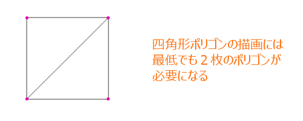
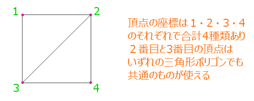
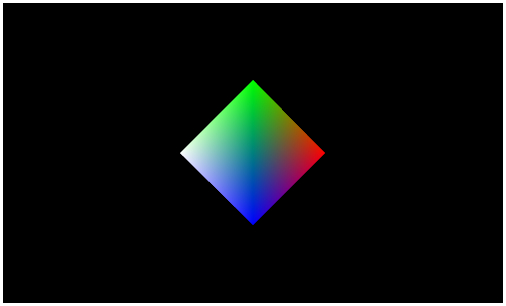

[返回目录](../README.md) 

# 十八，利用索引缓存来绘图

## 对应复杂的模型
上次，通过操作模型坐标变换矩阵，实现了多个模型的移动，旋转和放大缩小。但是，渲染的依然是简单的三角形，是个构造及其简单的模型。
但是实际中，用WebGL来绘制一个简单的三角形的机会是很少见的。至少是个四角多边形吧，通常会是更复杂的模型。

伴随着模型的复杂化，顶点的个数也会大幅度增加，越是精密圆滑的模型，所需要的顶点的量也会变的肥大化。javascript中倒是没有什么限制，也不是为了节省内存或者是节省代码量，直接绘制这些大量顶点数据也不是说不可以，但是尽可能的减少数据量这种想法是程序员本性。

在WebGL中，有一种方法可以防止顶点数据的肥大化，是使用索引缓存来管理顶点数据。索引缓存又叫IBO（index buffer objact），是缓存的一种。而且，现在为止一直使用的类似的缓存还有VBO，IBO一般和VBO一起使用。

## 顶点的增加
像刚才说的一样，顶点增加的越多，管理的顶点数据就越庞大。但是，可以使用反复使用少量的顶点来形成多边形。

来看一下具体的例子吧。

多边形是由三角形组成的，比如一个矩形就是由两个三角形组成的。



那么，这时候需要几个顶点呢？

看刚才的图的话，需要四个顶点，而定义一个三角形需要三个顶点，两个多边形的话，按说是应该需要六个顶点的吧。

顶点的坐标情报是完全相同的，如果重复的顶点多次被定义的话，明显是浪费的。所以，应该考虑顶点的重复利用。



重复的顶点的再利用，尽可能减少顶点数据，这时候顶点缓存就出现了。顶点缓存，是用来保存顶点的索引情报的。像刚才的图一样，第一个多边形使用的是[ 1, 2, 3 ]这三个顶点，同样，第二个多边形使用的是[ 2, 3, 4 ]这三个顶点。

这样，绘制多边形的时候告诉WebGL使用哪些顶点的就是顶点索引，这次的四边形效果还不够明显，而越是巨大的复杂的模型，使用索引缓存的作用就会越大。

使用索引缓存，除了节省代码量之外，还有另外很大的好处。

使用索引缓存的话，可以直接使用GPU的内存，不用每次绘图都向GPU传递数据，这样速度会更快。

技能节省代码量，又实现高速化，所以没有理由不使用IBO。

## IBO的生成
索引缓存的生成步骤，和顶点缓存类似，虽然有几个参数变化，但是基本上是同样的流程。

这次的demo新定义了一个create_ibo函数，来看一下代码吧。
#### 自定义函数create_ibo
```
// IBO的生成函数
function create_ibo(data){
    // 生成缓存对象
    var ibo = gl.createBuffer();
    
    // 绑定缓存
    gl.bindBuffer(gl.ELEMENT_ARRAY_BUFFER, ibo);
    
    // 向缓存中写入数据
    gl.bufferData(gl.ELEMENT_ARRAY_BUFFER, new Int16Array(data), gl.STATIC_DRAW);
    
    // 将缓存的绑定无效化
    gl.bindBuffer(gl.ELEMENT_ARRAY_BUFFER, null);
    
    // 返回生成的IBO
    return ibo;
}
```
和生成VBO的时候一样，首先使用createBuffer函数来生成空的缓存对象，然后绑定缓存，bindBuffer函数的第一个参数是一个和VBO不一样的内置常量 gl.ELEMENT_ARRAY_BUFFER，指定这个常量生成的缓存就是IBO。

然后绑定缓存并写入数据，VBO的时候，传入的参数的是Float32Array型数据，但是索引缓存使用的不是浮点型小数，而是整数，所以这里使用的是Int16Array型数据。

这个自定义函数create_ibo，传入的参数是一个数组，和生成VBO的函数create_vbo是一样的。IBO所用的数组数据和VBO一样，都是提前定义好的。
#### 索引数据的数组定义的例子
```
var index = [
    0, 1, 2,
    1, 2, 3
];
```
有四个顶点的时候，像上面写的一样，第一个三角形使用顶点[ 0, 1, 2 ]，第二个三角形使用顶点[ 1, 2, 3 ]来绘制的意思。顶点的索引是从0开始的，需要注意，数组是一维数组。

## 绘图相关的变更点
了解了索引缓存的生成，接着看一下索引缓存的使用步骤。

使用IBO进行渲染，需要提前将IBO和WebGL进行绑定，用下面的代码可以实现。
#### IBO绑定的代码
```
gl.bindBuffer(gl.ELEMENT_ARRAY_BUFFER, ibo);
```
传入刚才生成的IBO（变量ibo），这样就完成了IBO的绑定，但是光是绑定IBO，是没办法进行绘图的，还需要修改一下绘图命令。

到现在为止，渲染多边形一直是使用drawArrays函数，为了使用IBO进行绘图，需要使用drawElements函数。这个函数的使用例子如下。
#### 使用drawElements函数的绘图命令举例
```
gl.drawElements(gl.TRIANGLES, index.length, gl.UNSIGNED_SHORT, 0);
```
这个drawElements函数有四个参数，第一个参数是表示渲染怎样的顶点的常量，第二个参数是索引缓存的元素数，第三个参数是索引数据的数据大小，第四个参数是索引数据的起始索引offset。

比较难理解的是第二个参数，这里的话，传入保存索引数据的数组长度的话就可以了，其他的参数没什么特殊限制的话，不做修改就这么使用的话就行了。

## 总结
使用索引缓存IBO，既可以节约数据，又能够提高渲染顶点的效率，而且，模型越复杂影响越大，这是程序员非常乐意看到的。

索引缓存和顶点缓存一样，可以使用纯粹的一维数组来生成，生成的IBO进行绑定后就可以使用了，利用IBO绘图的时候使用drawElements函数是重点。

这次的demo，顶点着色器和片段着色器是没有任何变化的，所以，还使用以前的HTML代码，javascript的内容多少有些变化，最后会给出完整代码，另外，文章最后会贴出本次demo的链接，可以参考一下。

下次，会介绍一下遮挡剔除和深度。
#### script.js的完整代码
```
onload = function(){
    // canvas对象获取
    var c = document.getElementById('canvas');
    c.width = 500;
    c.height = 300;
    
    // webgl的context获取
    var gl = c.getContext('webgl') || c.getContext('experimental-webgl');
    
    // 顶点着色器和片段着色器的生成 
    var v_shader = create_shader('vs');
    var f_shader = create_shader('fs');
    
    // 程序对象的生成和连接
    var prg = create_program(v_shader, f_shader);
    
    // attributeLocation的获取
    var attLocation = new Array(2);
    attLocation[0] = gl.getAttribLocation(prg, 'position');
    attLocation[1] = gl.getAttribLocation(prg, 'color');
    
    // 将元素数attribute保存到数组中
    var attStride = new Array(2);
    attStride[0] = 3;
    attStride[1] = 4;
    
    // 保存顶点的颜色情报的数组
    var position = [
         0.0,  1.0,  0.0,
         1.0,  0.0,  0.0,
        -1.0,  0.0,  0.0,
         0.0, -1.0,  0.0
    ];
	// 保存顶点的颜色情报的数组  
    var color = [
        1.0, 0.0, 0.0, 1.0,
        0.0, 1.0, 0.0, 1.0,
        0.0, 0.0, 1.0, 1.0,
        1.0, 1.0, 1.0, 1.0
    ];
    
    // 保存顶点的索引的数组
    var index = [
        0, 1, 2,
        1, 2, 3
    ];
    
    // 生成VBO
    var pos_vbo = create_vbo(position);
    var col_vbo = create_vbo(color);
    
    // 将VBO进行绑定并添加
    set_attribute([pos_vbo, col_vbo], attLocation, attStride);
    
    // 生成IBO
    var ibo = create_ibo(index);
    
    // IBO进行绑定并添加
    gl.bindBuffer(gl.ELEMENT_ARRAY_BUFFER, ibo);
    
    // uniformLocationの取得
    var uniLocation = gl.getUniformLocation(prg, 'mvpMatrix');
    
    // 使用minMatrix.js对矩阵的相关处理
    // matIV对象生成
    var m = new matIV();
    
    // 各种矩阵的生成和初始化 
    var mMatrix = m.identity(m.create());
    var vMatrix = m.identity(m.create());
    var pMatrix = m.identity(m.create());
    var tmpMatrix = m.identity(m.create());
    var mvpMatrix = m.identity(m.create());
    
    // 视图x投影坐标变换矩阵
    m.lookAt([0.0, 0.0, 5.0], [0, 0, 0], [0, 1, 0], vMatrix);
    m.perspective(45, c.width / c.height, 0.1, 100, pMatrix);
    m.multiply(pMatrix, vMatrix, tmpMatrix);
    
    // 定义计数器
    var count = 0;
    
    // 持续循环
    (function(){
        // canvasを初期化
        gl.clearColor(0.0, 0.0, 0.0, 1.0);
        gl.clearDepth(1.0);
        gl.clear(gl.COLOR_BUFFER_BIT | gl.DEPTH_BUFFER_BIT);
        
        // 计数器递增
        count++;
        
        // 使用计数器算出角度 
        var rad = (count % 360) * Math.PI / 180;
        
        // 模型坐标变换矩阵的生成(沿着Y轴旋转)
        m.identity(mMatrix);
        m.rotate(mMatrix, rad, [0, 1, 0], mMatrix);
        m.multiply(tmpMatrix, mMatrix, mvpMatrix);
        gl.uniformMatrix4fv(uniLocation, false, mvpMatrix);
        
        // 使用索引进行绘图
        gl.drawElements(gl.TRIANGLES, index.length, gl.UNSIGNED_SHORT, 0);
        
        // context刷新
        gl.flush();
        
        // 为了循环，进行递归处理  
        setTimeout(arguments.callee, 1000 / 30);
    })();
    
    // 生成着色器的函数  
    function create_shader(id){  
        // 用来保存着色器的变量  
        var shader;  
          
        // 根据id从HTML中获取指定的script标签  
        var scriptElement = document.getElementById(id);  
          
        // 如果指定的script标签不存在，则返回  
        if(!scriptElement){return;}  
          
        // 判断script标签的type属性  
        switch(scriptElement.type){  
              
            // 顶点着色器的时候  
            case 'x-shader/x-vertex':  
                shader = gl.createShader(gl.VERTEX_SHADER);  
                break;  
                  
            // 片段着色器的时候  
            case 'x-shader/x-fragment':  
                shader = gl.createShader(gl.FRAGMENT_SHADER);  
                break;  
            default :  
                return;  
        }  
          
        // 将标签中的代码分配给生成的着色器  
        gl.shaderSource(shader, scriptElement.text);  
          
        // 编译着色器  
        gl.compileShader(shader);  
          
        // 判断一下着色器是否编译成功  
        if(gl.getShaderParameter(shader, gl.COMPILE_STATUS)){  
              
            // 编译成功，则返回着色器  
            return shader;  
        }else{  
              
            // 编译失败，弹出错误消息  
            alert(gl.getShaderInfoLog(shader));  
        }  
    }  
      
    // 程序对象的生成和着色器连接的函数  
    function create_program(vs, fs){  
        // 程序对象的生成  
        var program = gl.createProgram();  
          
        // 向程序对象里分配着色器  
        gl.attachShader(program, vs);  
        gl.attachShader(program, fs);  
          
        // 将着色器连接  
        gl.linkProgram(program);  
          
        // 判断着色器的连接是否成功  
        if(gl.getProgramParameter(program, gl.LINK_STATUS)){  
          
            // 成功的话，将程序对象设置为有效  
            gl.useProgram(program);  
              
            // 返回程序对象  
            return program;  
        }else{  
              
            // 如果失败，弹出错误信息  
            alert(gl.getProgramInfoLog(program));  
        }  
    }  
      
    // 生成VBO的函数  
    function create_vbo(data){  
        // 生成缓存对象  
        var vbo = gl.createBuffer();  
          
        // 绑定缓存  
        gl.bindBuffer(gl.ARRAY_BUFFER, vbo);  
          
        // 向缓存中写入数据  
        gl.bufferData(gl.ARRAY_BUFFER, new Float32Array(data), gl.STATIC_DRAW);  
          
        // 将绑定的缓存设为无效  
        gl.bindBuffer(gl.ARRAY_BUFFER, null);  
          
        // 返回生成的VBO  
        return vbo;  
    }  
      
// 绑定VBO相关的函数  
function set_attribute(vbo, attL, attS){  
    // 处理从参数中得到的数组  
    for(var i in vbo){  
        // 绑定缓存  
        gl.bindBuffer(gl.ARRAY_BUFFER, vbo[i]);  
          
        // 将attributeLocation设置为有效  
        gl.enableVertexAttribArray(attL[i]);  
          
        //通知并添加attributeLocation  
        gl.vertexAttribPointer(attL[i], attS[i], gl.FLOAT, false, 0, 0);  
    }  
}  
    // IBO的生成函数
function create_ibo(data){
    // 生成缓存对象
    var ibo = gl.createBuffer();
    
    // 绑定缓存
    gl.bindBuffer(gl.ELEMENT_ARRAY_BUFFER, ibo);
    
    // 向缓存中写入数据
    gl.bufferData(gl.ELEMENT_ARRAY_BUFFER, new Int16Array(data), gl.STATIC_DRAW);
    
    // 将缓存的绑定无效化
    gl.bindBuffer(gl.ELEMENT_ARRAY_BUFFER, null);
    
    // 返回生成的IBO
    return ibo;
}
 
};
```

下面的链接是这次的demo，可以直接运行，所以一定参考一下。

利用索引缓存（IBO）绘图的demo



[http://wgld.org/s/sample_006/](http://wgld.org/s/sample_006/)