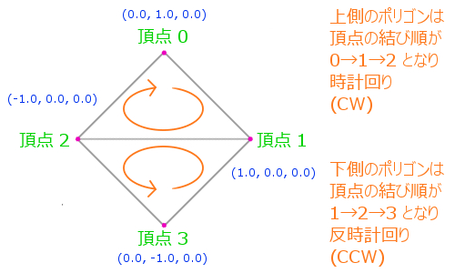
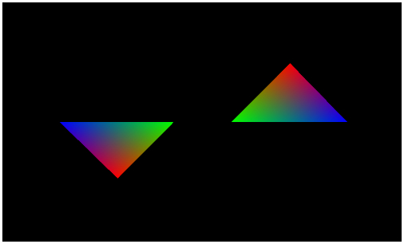

[返回目录](../README.md) 

# 十九，遮挡剔除和深度测试

## 多边形的外侧，内侧和遮挡剔除
上次介绍了索引缓存，以及使用IBO来绘图，使用索引缓存可以循环利用重复的顶点，能够提高绘图效率。这之后的文章，如果没有特殊的原因的话，基本上都会使用索引缓存，通过drawElements来绘图。

这次来说一下遮挡剔除和深度测试,这是两个重要的概念，内容并不是那么难。

首先来看遮挡剔除，如果看过之前的文章，应该知道［遮挡剔除］的概念，之前的文章（六，顶点和多边形）中有过说明。

简单的说，遮挡剔除就是以多边形内外侧为基准，判断是否绘制这个多边形。而多边形的内侧和外侧的判断方法，在之前的文章中已经详细说明了。为了加深印象，这里再说一遍。

WebGL中，默认规定遮挡剔除是无效的，无论以怎样的顺序来定义顶点都会绘制全部的多边形。但是，遮挡剔除有效的时候，只有满足特定的条件的多边形才会进行绘制，看不见的部分是不会绘制的，这样就会减弱坐标计算等负担。

为了设置WebGL中的遮挡剔除为有效，需要像enable函数中传入适当的参数，这个enable函数不光是用来控制遮挡剔除的，还有其他很多各种各样的参数，根据指定的参数不同会把相应的功能设置为有效。将遮挡剔除设置为有效的话，需要传入内置常量gl.CULL_FACE ，下面是代码举例。

#### 将遮挡剔除设置为有效的代码示例
```
gl.enable(gl.CULL_FACE);
```
相反的，将相应的功能设置为无效的话，使用disable函数，传入的参数和enable函数相同。

#### 遮挡剔除的内侧和外侧切换的方法
```
多边形的内侧和外侧是根据顶点的连接顺序来判断的，而这个判断基准反过来的情况也是有的，形成多边形的顶点的连接顺序是顺时针的时候是外侧，逆时针的时候为内侧，想要反过来判断的话，顺时针就变成了内侧。

顺时针统称为CW，因为［顺时针］的英语是ClockWise，CW就是它的头文字。而逆时针统称为CCW，因为［逆时针］的英语为CounterClockWise。改变WebGL中遮挡剔除的内侧和外侧的判断标准的函数是frontFace，参数就是刚才提到的CW和CCW。

将顺时针设置为［外侧］的代码：gl.frontFace(gl.CW);

将顺时针设置为［内侧］的代码：gl.frontFace(gl.CCW);
```
## 深度测试
接着来说深度测试。

刚才提到的设置遮挡剔除的函数enable，也可以用来设置深度有效，将常量gl.DEPTH_TEST作为参数传给enable函数的话，就可以将深度测试设置为有效，同样的，使用disable函数可以将其设置为无效。

深度测试的默认值是无效的，那将深度测试设置为有效有什么用处呢，为什么要设置深度有效呢？

深度测试可以联想到［深度］这个词，三维空间中表示向里的方向时是必不可少的一个元素，DirectX中叫做Z测试，要表示一个物体在你面前呢，还是向里一段距离呢，所以深度测试就是必须的了。

WebGL中发出绘图命令的时候，是在一个模拟的三维空间中绘制模型的，这时候根据绘制的先后顺序，先绘制的东西会被后绘制的东西覆盖掉，这跟物体是在当前还是在里面是没关系的。而实际上，在远处的物体应该被在近处的物体所覆盖。

将深度测试设置为有效的话，就是对模型的深度进行评价，评价合格的东西会绘制到画面上，不合格的东西就不会进行绘制了。

和刚才的遮挡剔除一样，将深度测试设置为有效或无效使用的是enable函数和disable函数。
#### 将深度测试设置为有效的代码示例
```
gl.enable(gl.DEPTH_TEST);
```
深度测试的评价函数为depthFunc，这个函数需要指定参数，一般是使用下面的常量作为参数。
#### 指定一般深度测试的评价方法
```
gl.depthFunc(gl.LEQUAL);
```
这里指定了内置常量gl.LEQUAL的话，就会把里侧的东西隐藏，反过来想一下，基本上不会指定成其他情况了吧。

## 总结
这次，介绍了遮挡剔除和深度测试，无论那一个都是使用enable函数来设置有效，使用disable函数来设置无效。enable和disable这两个函数的参数是一致的，根据传入的参数不同，可以设定各种属性设置为有效或者无效。

遮挡剔除设置为有效的话，内侧的多边形就不会描画了，这样就减轻了绘图的负担。深度测试在模拟有深度概念的三维空间时有着非常重要的作用，指定为正确的评价方法的话，就能像现实世界一样，近处的物体会将远处的物体遮挡住。

这次做的demo，可以自由切换遮挡剔除的有效和无效，而且可以自由指定多边形的内测和外侧，demo页面的单选框选中或者不选，可以切换相应的状态，而深度测试也时可以自由切换有效或是无效的，可以通过实际操作来观察一下，深入理解一下遮挡剔除和深度测试。
### demo的内容补充
demo中绘制了四个角的多边形，一共绘制了两个四边形，一个是沿着X轴旋转，另一个是沿着Y轴旋转，并且这两个四边形都绕着原点进行着旋转移动，将深度测试设置为有效的话，里面的四边形就会被外面的四边形遮住了。

仔细看demo的代码的话，就应该能知道，这两个四边形都分别是一个面向里侧，一个面向外侧的三角形组成的。这样的话，将遮挡剔除设置为有效的话，多边形的上下部分就只能绘制一个了。



顶点的连接顺序，看一下定义的索引缓存的数组的话，就明白了，下面是代码。
#### 定义索引的数组的代码
```
// 保存顶点属性的数组
var position = [
     0.0,  1.0,  0.0,
     1.0,  0.0,  0.0,
    -1.0,  0.0,  0.0,
     0.0, -1.0,  0.0
];
 
// 保存顶点的索引的数组
var index = [
    0, 1, 2,
    1, 2, 3
];
```
看一下上面的图和代码，然后比较一下，就明白是定义了面向内侧和外侧两个三角形来生成四边形了。这是为了测试遮挡剔除而专门这么定义的。正常来说，制作3D模型的时候，是不会像这样将里侧和外侧混在一起定义的，否则用遮挡剔除的话，模型就会出现穿孔了。

下面的链接是这次的demo，可以直接运行，所以一定参考一下。

遮挡剔除和深度测试的demo



[http://wgld.org/s/sample_007/](http://wgld.org/s/sample_007/)