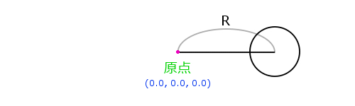
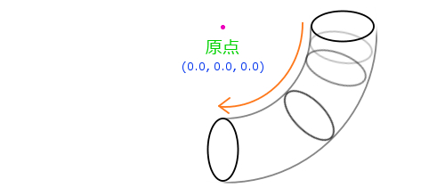
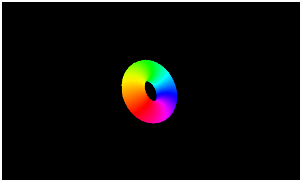

[返回目录](../README.md) 

# 二十，绘制立体模型（圆环体）

## 立体的模型
这次稍微喘口气，开始绘制立体模型。

这里说的［喘口气］是指本次的文章中没有出现任何新的技术知识点。只是利用到现在为止所介绍过的内容，来绘制一个立体的圆环体。

到现在为止，只绘制了三角形和四边形，当然，在三维空间中绘制简单的多边形也没什么不对，但是缺点儿说服力。这次绘制一个圆环体，体验一下像样的3D绘图。

要说圆环体的定义的话，不太好解释，其实就是一个跟“甜甜圈[^1] ”一样形状的模型。准备圆环体模型数据的时候，需要使用正弦和余弦来计算三维空间中顶点的位置。
具体的话，首先在距离原点开始一定距离R的地方开始画一个圆。



如上图，是三维空间的一个横切面。

接着，以Y轴为中心，像圆规一样旋转，不断的添加顶点。



如上图所示的效果，旋转一周的话，就能定义出“甜甜圈”形状的顶点了，这次用程序来模拟一下。
## 圆环体的顶点数据的生成
新建一个函数来生成圆环体的模型数据。

可以把它想象成将一个管子形状的模型做成一个轮子。指定了原点到管子的中心的距离以及管子自身的粗细（半径）的话，就可以生成圆环体了。而且，形成管子的顶点越多，绘制圆环体的曲线就会越圆滑。这次新建的函数，接受这些参数，然后返回生成的模型的顶点属性数组。
#### 生成圆环体模型数据的函数
```
function torus(row, column, irad, orad){
    var pos = new Array(), col = new Array(), idx = new Array();
    for(var i = 0; i <= row; i++){
        var r = Math.PI * 2 / row * i;
        var rr = Math.cos(r);
        var ry = Math.sin(r);
        for(var ii = 0; ii <= column; ii++){
            var tr = Math.PI * 2 / column * ii;
            var tx = (rr * irad + orad) * Math.cos(tr);
            var ty = ry * irad;
            var tz = (rr * irad + orad) * Math.sin(tr);
            pos.push(tx, ty, tz);
            var tc = hsva(360 / column * ii, 1, 1, 1);
            col.push(tc[0], tc[1], tc[2], tc[3]);
        }
    }
    for(i = 0; i < row; i++){
        for(ii = 0; ii < column; ii++){
            r = (column + 1) * i + ii;
            idx.push(r, r + column + 1, r + 1);
            idx.push(r + column + 1, r + column + 2, r + 1);
        }
    }
    return [pos, col, idx];
}
```
这个torus函数，一共接收四个参数。

第一个参数，是将管子分割成多少份，这个数值越大，生成的圆环体就越圆滑，数值太小的话，就会出现棱角。

第二个参数，是构成这个管子的圆是多少个顶点，数值越大，管子就越接近一个圆的形状，太小的话，这个圆就有棱角了。

第三个参数，是生成这个管子的半径。

第四个参数，是原点到管子中心的距离。

## HSV色彩模式到RGB色彩模式的转换
生成圆环体的模型数据的函数中，还使用了另一个函数，就是将返回值赋给变量tc的函数hsva。

这次的demo，圆环体中使用HSV色彩模式。HSV是一种和RGB不同的表示颜色的方法，使用颜色的[ 色调 = Hue ]・[ 饱和度 = Saturation ]・[ 亮度 = Value ]来表示颜色。

使用RGB来指定颜色是很麻烦的，使用HSV的话就非常简单了，这次的demo，内置了一个从HSV到RGB之间颜色转换的函数，这样就可以给圆环体添加一个漂亮的彩虹颜色了。
#### HSV转换到RGB的函数
```
function hsva(h, s, v, a){
    if(s > 1 || v > 1 || a > 1){return;}
    var th = h % 360;
    var i = Math.floor(th / 60);
    var f = th / 60 - i;
    var m = v * (1 - s);
    var n = v * (1 - s * f);
    var k = v * (1 - s * (1 - f));
    var color = new Array();
    if(!s > 0 && !s < 0){
        color.push(v, v, v, a); 
    } else {
        var r = new Array(v, n, m, m, k, v);
        var g = new Array(k, v, v, n, m, m);
        var b = new Array(m, m, k, v, v, n);
        color.push(r[i], g[i], b[i], a);
    }
    return color;
}
```
这个函数为了表示HSV的颜色，接收四个参数，第四个参数是透明度，这个函数中就是将颜色转换为RGBA然后返回结果。

HSV中，色调的范围是0 ～ 360，函数中为了防止出错添加了超过这个数值的处理。但是，需要注意的是，饱和度和亮度如果传入的值不正确，就不能返回正确的结果了，饱和度，亮度和透明度的取值范围是 0 ～ 1。

生成圆环体的函数，以及HSV转换到RGB的函数，函数内部的代码就不做详细的说明了，想了解的朋友，可以自己看一下。

## 总结
这次，并没有对WebGL相关的新技术进行说明，这一点运行一下demo就能知道了，果然，比起绘制简单的板状的多边形来说，像圆环体这样的立体模型绘制起来更有意思吧。

demo中使用的着色器和HTML跟以前并没有变化，javascript相关部分，也只是添加了一个生成圆环体的函数和一个HSV转换的函数，没有什么特别的变更点。

demo中绘制的圆环体，会沿着Y轴和Z轴进行旋转，使用了七彩颜色，看起来应该挺赏心悦目的吧。demo的链接在文章的最下面。

下次，会介绍一下简单的光源。

下面的链接是这次的demo，可以直接运行，所以一定参考一下。

绘制立体模型（圆环体）



[http://wgld.org/s/sample_008/](http://wgld.org/s/sample_008/)


[^1]: [甜甜圈百科](https://baike.baidu.com/item/%E7%94%9C%E7%94%9C%E5%9C%88/27427)