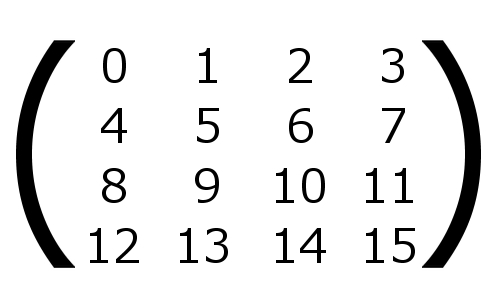

[返回目录](../README.md) 

# 五，矩阵的基础知识

## 不是让你到店前面排队 [^1]
在3D渲染的世界里，会很频繁的用到矩阵。

这里所说的矩阵，是数学里的矩阵。英语中叫做Matrix。

矩阵虽然听起来好像很简单，矩阵也有很多种，而且计算方法非常难或者说非常麻烦。简单的说，矩阵就是把数字像箱子一样排列，将数字横竖排列起来就形成了矩阵。在平常的生活中是用不到的，但是在3D渲染的世界中却是不可缺少的一个元素。

[^1]:你一定奇怪，为什么叫这个题目，因为日语中的矩阵叫做“行列”，所以作者就给读者们开了个玩笑，我就这么直接翻译了，大家知道什么意思就行了。

## 为什么需要矩阵
​虽然说矩阵在3D渲染中不可缺少，但是可能完全没有接触过它的人也不在少数。那为什么矩阵如此重要呢？

模拟三维空间，需要非常多的计算。什么样的东西，在哪里，什么角度，大小如何，只绘制想要绘制的模型数等等，都需要进行非常复杂且大量的计算。

矩阵就是像刚才说的那样，把数字按照行和列排列起来，在实际应用中，一个矩阵中可以包含很多的情报。

比如说，想要绘制的模型在世界的什么位置放置着，是否发生了旋转，是否进行了放大和缩小，摄影的镜头在什么位置，镜头的方向如何，最终成像后的画面的横竖比例如何......等等，这些情报都可以用一个矩阵来表示。

如果你看了前面的文章（[三，3D绘图的基础知识](./3.md)），并且你是个细心的人的话，应该注意到了吧，模型在世界的什么位置，镜头的方向等，前面都已经介绍过了。

也就是说，模型坐标变换，视图坐标变换，投影坐标变换，这些一连串的坐标变换如果使用矩阵的话，就可以在一个矩阵中完成所有的坐标变换处理。不管怎么说，为什么矩阵这么重要，大家应该大概了解了吧。主要是，矩阵的计算效率很高，而且及其便利。

## 3D渲染和矩阵
上面说矩阵是由数字组合起来的，那么矩阵到底是个什么东西呢？

矩阵虽然有很多种，其中的一种叫做方阵。就是行数和列数相同的矩阵。

上面这样的矩阵，就叫做方阵。

这样的方阵，一般的3D渲染的世界中使用的是4x4的矩阵。就像刚刚给的图一样，行和列都是4个元素组成，这就是3D渲染中使用的矩阵的类型。

那为什么不是3x3的方阵或者其他的矩阵，而偏偏是4x4的方阵，这是有原因的。不过，现在先不用在意这些。只要先记住，矩阵是能够让3D渲染中的计算变的简单的一个机制就行了。

矩阵完全是数学的话题，所以理解起来可能非常的难。虽然说，最好是仔细的学一下，但是现在的阶段，只需要知道矩阵是个什么东西就可以了。＊实际上，我也不是数学专业，也不可能对矩阵的每一个细节都完全理解。

实际3D渲染的时候，像上面说的那样，准备好模型坐标变换，视图坐标变换，投影坐标变换的各个矩阵。再具体一点，就是准备好各种坐标变换的矩阵，然后相乘。将最终得到的矩阵传给WebGL的顶点着色器。

顶点着色器从传过来的矩阵中，获取到模型的坐标，加工到画面上显示出来。也就是说，操作坐标变换的矩阵，就可以决定模型在画面上如何绘制。

## 矩阵能做什么
前面也说了，坐标变换有模型变换，视图变换，投影变换等多种。

矩阵可以将上面提到的变换保存起来，比如，如果是模型变换的矩阵，想要绘制的3D模型的位置，扩大缩小，以及旋转等信息，都可以定义在一个矩阵中。视图变换矩阵，镜头的位置，镜头的方向，以及镜头对准了哪个点（注视点）等可以定义在一个矩阵中。投影变换矩阵的话，显示的横竖比例和视角等信息可以定义在一个矩阵中。

而且，这三个矩阵可以相互组合，最终得出的变换矩阵传给着色器，但是这里需要注意一点，如果是普通的数学计算，相乘的时候，不需要注意相乘的顺序，比如2x3等于6，3x2也等于6。但是矩阵的话，根据相乘的顺序得出的结果是不同的。因为矩阵的这种性质，所以进行模型，视图，投影的矩阵相乘的时候，要特别注意相乘的顺序。

到实际写程序的时候，我会进一步详细说明，首先要记住矩阵相乘的顺序非常的重要。

## 总结
好了，说了这么多，对矩阵也多少有些了解了吧。

这次，不是让你完全理解矩阵，就是先介绍一下，如果要真的讲解矩阵的话，你必须一个脚踩进数学世界的大门才行。

进行3D渲染，矩阵是不可缺少的，而且要彻底理解矩阵是非常难的。所以现在先明白一下矩阵到底是个什么东西就行了。

以后，我有可能会专门进行矩阵的讲解，首先，简单理解一下就好。重要的是，比起零基础，先来知道一下矩阵的用处。如果有兴趣的话，网上有很多相关的介绍，理解的越深肯定越好。如果有时间的话，可以先自己看一下。