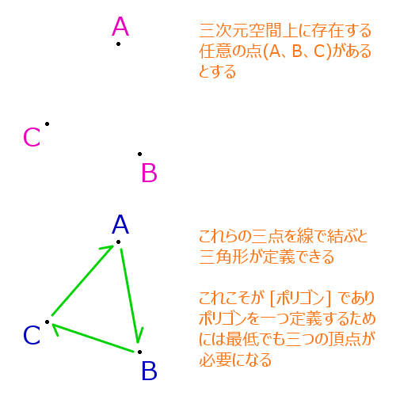
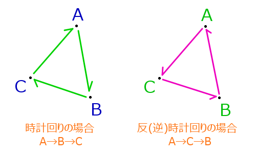

[返回目录](../README.md) 

# 六，顶点和多边形

## 可以在三维空间中描画的东西
要说在WebGL的世界里能够描画什么，其实任何东西都可以描画。而描画的最基本的东西就是下面几种。

- 点
- 线段
- 三角形

虽然在OpenGL中提供了矩形的绘制，但是WebGL中基本上只能绘制上面的三种类型。和二维世界不同，比如像HTML中的img标签那样，简单的在画面上绘制一个矩形图像是不能的。

先不说点和线，基本上，WebGL就是使用三角形在画面上绘制一些东西。这个三角形就是一个多边形，一个多边形至少是将三个顶点连接画出来的三角形，所以一个绘制一个多边形，最少需要三个顶点。

顶点，就是三维空间上存在的一个点。当然，这个点需要有坐标位置。顶点的横坐标是x，纵坐标是y，深度是z。将包含这些信息的点连接起来就形成了一个多边形。

近年来，非常逼真的3D游戏，或者迪斯尼，组织活动等制作的3D动画，其实就是做了同样的事情。用了你想像不到的大量的三角形，制作出了无比精美的人物和场景。

想要绘制复杂构造的模型的话，需要准备大量的非常小的多边形。用的多边形越少，绘制的模型的棱角就越明显(就像Virtua Fighter第一代那样)。想要绘制精美的模型，就需要更多的多边形，当然，这些多边形的数量增加的话，定点数量也会成倍成倍的增加，坐标计算的负荷就越大。

3D渲染世界的难点就在于，到底顶点数，多边形数增加到多少比较合适。太多的顶点和多边形，处理速度可能跟不上，太少的话，视觉效果又会降低。

如果是抽象的设计的话，顶点数量和多边形数量会大幅度减少，但是要说到设计，也是比较难的，真烦人呢。

## 顶点的连接顺序和遮挡剔除
使用顶点和线连接起来绘制多边形，是有连接顺序的。顺时针连接或是逆时针顺序连接，实际上这个顺序非常重要。

要说这是为什么，比如要绘制一个球体，球体的话，无论你从什么位置摄影，肯定都是一个球。而且，肯定是只能看到一半。月亮看不到后半面也是同样的道理，球体的前半面以外的部分都被隐藏了。

隐藏的部分是不需要绘制的，如果这部分进行了坐标计算，那么都是无效的计算。球体内侧相关的处理如果不执行的话，处理的量就会减少一半，所以3D渲染的世界里，看不到的东西不绘制的是减轻负担的最普通的方法。

里面的东西不绘制的机制，叫做遮挡剔除。OpenGL和WebGL当然都是可以设定遮挡剔除的。如果设定了遮挡剔除，就只会绘制外侧看得见的多边形，内侧的所有多边形就都不再进行绘制了。

但是，试着想一想，多边形在内侧还是外侧的判断，要如何进行呢？

实际上，就是通过刚才说的顶点的连接顺序为判断基准的。顺时针连接顶点的多边形是在外侧，而逆时针连接的多边形在内侧。所以，在定义顶点情报的时候，要特别注意。如果设定了遮挡剔除，本来应该在某个位置有个多边形，但是根本就不会进行绘制。

## 总结
顶点就是至少包含了坐标情报的三维空间上的任意的一个点，三个点用线连接起来，表现为一个三角形的多边形。而多边形根据顶点的连接顺序不同，分为内侧和外侧，根据这个可以进行遮挡剔除。

接下来，实际进行渲染的时候，会从顶点的情报的定义开始。这时候，顶点的顺序，遮挡剔除等设定就变得非常重要了，所以一定要把这次的内容彻底理解。